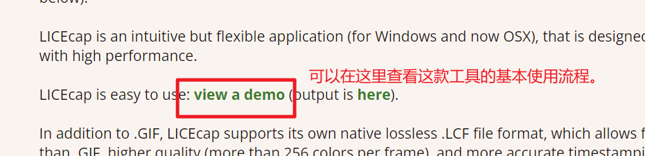
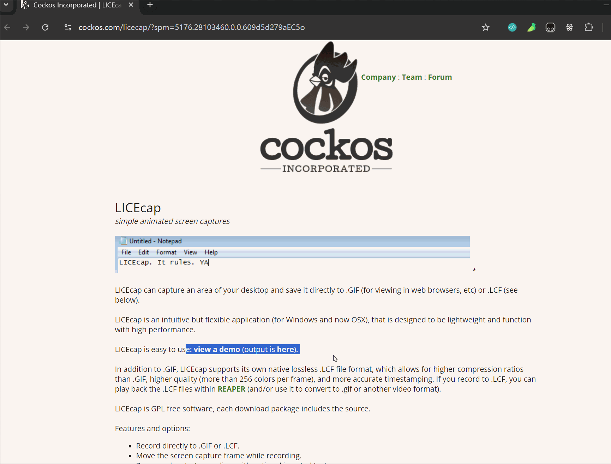

# [0001. 如何截 gif 图片？](https://github.com/Tdahuyou/pc/tree/main/0001.%20%E5%A6%82%E4%BD%95%E6%88%AA%20gif%20%E5%9B%BE%E7%89%87%EF%BC%9F)

## 📝 summary

- LICEcap 实测可用，使用步骤也比较简单，可以在官方文档中点击 view a demo 来快速了解这玩意儿应该如何使用。
  - 
- ScreenToGif、ShareX 未尝试过。
- 内置工具（Windows 10/11），这玩意儿用来录制视频也许更合适一些，后续可以尝试看看。重点关注录制的视频的效果如何（重点关注：画质、帧数、音质、体积）。

## 💻 demo - LICEcap 录制效果展示

- 下面这是使用 LICEcap 简单录制的一个 gif 图。
  - 

## 🤖 AI - 你知道在 window 上如何截 gif 图吗？

在 Windows 上截取 GIF 动图有多种工具可以选择。以下是一些常用的方法和工具：

### 1. 使用 LICEcap

LICEcap 是一个非常流行且易于使用的免费工具，可以录制屏幕并保存为 GIF 格式。

#### 下载和安装

- 访问 [LICEcap 官方网站](https://www.cockos.com/licecap/) 下载 LICEcap。
- 下载后直接运行即可，无需安装。

#### 使用步骤

1. 打开 LICEcap。
2. 点击“File” > “New Capture” 或者直接点击主界面的按钮来开始新的录制。
3. 选择要录制的区域，可以通过拖动框来调整大小。
4. 设置帧率（FPS）和输出文件路径。
5. 点击“Record” 开始录制。
6. 完成录制后，点击“Stop” 停止录制，GIF 文件将自动保存到指定位置。

### 2. 使用 ScreenToGif

ScreenToGif 是另一个功能强大的免费工具，支持录制屏幕、摄像头和绘制动画，并且可以直接编辑 GIF。

#### 下载和安装

- 访问 [ScreenToGif 官方网站](https://www.screentogif.com/) 下载 ScreenToGif。
- 下载后直接运行即可，无需安装。

#### 使用步骤

1. 打开 ScreenToGif。
2. 选择录制模式（例如，“Recorder” 用于屏幕录制）。
3. 选择要录制的区域，可以通过拖动框来调整大小。
4. 点击“Record” 开始录制。
5. 完成录制后，点击“Stop” 停止录制。
6. 在编辑器中可以对录制的内容进行编辑，例如删除不需要的帧、添加文字等。
7. 点击“Save As” 保存为 GIF 格式。

### 3. 使用 ShareX

ShareX 是一个开源的屏幕捕捉和分享工具，支持多种格式，包括 GIF。

#### 下载和安装

- 访问 [ShareX 官方网站](https://getsharex.com/) 下载 ShareX。
- 下载后运行安装程序进行安装。

#### 使用步骤

1. 打开 ShareX。
2. 在主界面中，点击“Capture” > “Screen Recorder” 或者使用快捷键（默认是 `Print Screen`）。
3. 选择要录制的区域，可以通过拖动框来调整大小。
4. 点击“Start” 开始录制。
5. 完成录制后，点击“Stop” 停止录制。
6. 录制完成后，ShareX 会自动打开编辑器，你可以对录制的内容进行编辑。
7. 保存为 GIF 格式。

### 4. 使用内置工具（Windows 10/11）

如果你使用的是 Windows 10 或 Windows 11，可以使用内置的“游戏栏”来录制屏幕，并通过其他工具转换为 GIF。

#### 使用步骤

1. 按 `Win + G` 打开游戏栏。
2. 点击“捕获”按钮旁边的录制按钮（圆形图标）开始录制。
3. 完成录制后，按 `Win + Alt + R` 停止录制。
4. 录制的视频会保存在“视频”文件夹中的“捕获”子文件夹里。
5. 使用在线工具（如 [EZGIF](https://ezgif.com/video-to-gif)）或桌面软件（如 GIMP）将视频转换为 GIF。

这些工具都相对简单易用，可以根据你的具体需求选择合适的工具。希望这些信息对你有帮助！