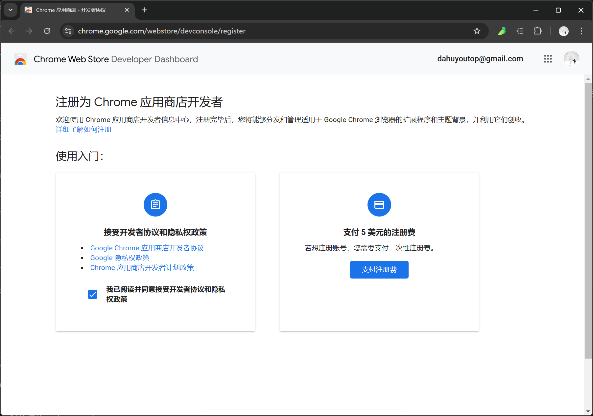

# [0016. chrome 插件发布流程](https://github.com/Tdahuyou/pc/tree/main/0016.%20chrome%20%E6%8F%92%E4%BB%B6%E5%8F%91%E5%B8%83%E6%B5%81%E7%A8%8B)

<!-- region:toc -->
- [1. ⏰ 缴 5 美元，发布 m2mm 插件，记录详细的发布流程。](#1--缴-5-美元发布-m2mm-插件记录详细的发布流程)
- [2. 🔗 注册成为 chrome 开发者](#2--注册成为-chrome-开发者)
- [3. 🔗 查看 Chrome 官方对开发者发布的插件的一些规范要求](#3--查看-chrome-官方对开发者发布的插件的一些规范要求)
- [4. 🔗 查看 chrome 插件开发文档 - API reference](#4--查看-chrome-插件开发文档---api-reference)
- [5. 📒 Chrome 插件发布的主要步骤](#5--chrome-插件发布的主要步骤)
  - [5.1. 前提条件](#51-前提条件)
  - [5.2. 发布步骤](#52-发布步骤)
  - [5.3. 注意事项](#53-注意事项)
<!-- endregion:toc -->

## 1. ⏰ 缴 5 美元，发布 m2mm 插件，记录详细的发布流程。

## 2. 🔗 注册成为 chrome 开发者

- https://chrome.google.com/webstore/devconsole/register

## 3. 🔗 查看 Chrome 官方对开发者发布的插件的一些规范要求

- https://developer.chrome.com/blog/cws-policy-revamp-jan23
  - Chrome Web Store Policy Updates
  - Chrome 应用商店政策更新| Blog
- https://www.google.com/url?sa=j&url=https%3A%2F%2Fdeveloper.chrome.com%2Fwebstore%2Fterms&uct=1720030413&usg=c0LQrHbWpDPnR7b8r_oZii0pPTk.&opi=70078707
  - Google Chrome 应用商店开发者协议
- https://policies.google.com/privacy?hl=zh-CN
  - Google 隐私权政策
- https://www.google.com/url?sa=j&url=https%3A%2F%2Fdeveloper.chrome.com%2Fwebstore%2Fprogram_policies&uct=1720030413&usg=-xRJbrW_V-8Fwq6JVDiAsXehncg.&opi=70078707
  - Chrome 应用商店开发者计划政策

## 4. 🔗 查看 chrome 插件开发文档 - API reference

- https://developer.chrome.com/docs/extensions/reference/api

## 5. 📒 Chrome 插件发布的主要步骤

发布 Chrome 插件需要遵循一定的流程和满足一些前提条件。以下是发布 Chrome 插件所需的主要步骤和条件：

### 5.1. 前提条件

1. **Google 账户**：
   - 需要一个有效的 Google 账户，因为 Chrome Web Store 使用 Google 账户进行登录和管理。
2. **Chrome 开发者仪表板账户**：
   - 注册并创建一个 Chrome 开发者仪表板账户。注册费用为 5 美元，支付成功后才能发布插件。
  - 
3. **开发环境**：
   - 安装 Chrome 浏览器，用于测试和调试插件。
   - 准备好开发工具，如文本编辑器或 IDE（如 Visual Studio Code、WebStorm 等）。
4. **插件代码和资源文件**：
   - 编写插件的代码，并准备好所有必要的资源文件（如图标、HTML 文件、JavaScript 文件等）。
   - 确保插件符合 Chrome Web Store 的政策和规范。
5. **manifest.json 文件**：
   - 创建一个 `manifest.json` 文件，这是 Chrome 插件的配置文件，包含插件的基本信息、权限和其他配置。

### 5.2. 发布步骤

1. **注册开发者账户**：
   - 访问 [Chrome 开发者仪表板](https://chrome.google.com/webstore/developer/dashboard)。
   - 使用 Google 账户登录。
   - 点击“注册”按钮，按照提示完成注册并支付 5 美元的注册费用。
2. **准备插件文件**：
   - 将插件的所有文件（包括 `manifest.json`）打包成一个 ZIP 文件。
3. **上传插件**：
   - 登录到 Chrome 开发者仪表板。
   - 点击“上传扩展程序”按钮，选择你打包好的 ZIP 文件。
   - 填写插件的相关信息，如名称、描述、类别、图标等。
   - 选择适当的隐私政策和许可协议。
4. **提交审核**：
   - 点击“发布”按钮，提交插件进行审核。
   - Chrome 团队会对插件进行审核，确保其符合相关政策和安全标准。审核时间通常为几个工作日。
5. **发布插件**：
   - 审核通过后，插件将出现在 Chrome Web Store 中，用户可以通过搜索找到并安装你的插件。

### 5.3. 注意事项

- **遵守政策**：确保插件符合 Chrome Web Store 的政策和规范，避免因违反政策而导致插件被拒绝或下架。
- **用户隐私**：尊重用户隐私，不要收集不必要的用户数据。
- **安全性**：确保插件没有安全漏洞，避免引入恶意代码。
- **用户体验**：提供良好的用户体验，确保插件功能稳定、界面友好。
